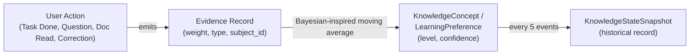

# MindVault — System Architecture & Viva Technical Specification

> **Academic Project**: BCA Minor Project II  
> **System Name**: MindVault (Cognitive Memory & Knowledge Management Assistant)  
> **Target Audience**: Evaluators, viva examiners, and maintainers.  
> **Guiding Principle**: Complete technical honesty. This document explicitly distinguishes between real, implemented capabilities and documented heuristics/future scope.

---

## 1. Executive Architecture Overview

Most conversational AI interfaces act as stateless pipelines: a user submits a prompt, the system appends the immediate chat transcript, and the LLM responds without knowing the user's persistent cognitive state, learning styles, or accumulated knowledge gaps.

MindVault was developed to solve this fundamental flaw by building a **Virtual Brain backend**:
1. **Persistent Cognitive Memory**: Manages slot-scoped factual and preference statements with conflict detection.
2. **Evidence-Driven Knowledge Progression**: Updates mastery and confidence dynamically through an append-only event log.
3. **Relational Knowledge Graph**: Models dependencies between concepts, subjects, documents, and goals.
4. **Knowledge-Delta–Aware Context Assembly**: Synthesizes 5 grounding layers into a personalized prompt that directs the LLM to focus on knowledge gaps and avoid explaining established concepts.
5. **Cognitive Reflection Dashboard**: Analyzes behavioral shifts over rolling windows to mirror user growth.
6. **Strict Multi-Tenant Isolation**: Enforces tenant scoping across all database queries and user-scoped filesystem paths.

```
       [ React + Vite Frontend (Reflection Dashboard, Goals, Vault, Chat) ]
                                      │
                                      ▼ HTTP / REST (JWT Auth)
                        [ FastAPI Application (app/api/*) ]
                                      │
            ┌─────────────────────────┴─────────────────────────┐
            ▼                                                   ▼
[ Core Services Layer ]                               [ Data & Storage Layer ]
 ├── EvidenceService                                   ├── SQLite Database (16 Tables)
 ├── KnowledgeGraphService                             │   └── (Users, Concepts, Evidence,
 ├── DocumentService                                   │        Memories, Goals, Tasks, etc.)
 ├── ContextAssemblyService                            └── User Upload Vault
 ├── DashboardService                                      └── uploads/{user_id}/
 └── AIService (OpenAI Wrapper)
```

---

## 2. Evidence → Knowledge Concept & Preference Pipeline



### 2.1 The Event-Sourced Evidence Stream (`Evidence`)
Rather than allowing arbitrary edits to knowledge levels, all cognitive updates originate from an immutable, append-only log in the `evidence` table. Each record captures:
- `user_id`: Tenant owner.
- `evidence_type`: `TASK_COMPLETION`, `QUESTION_ASKED`, `DOCUMENT_READ`, `EXPLICIT_STATEMENT`, or `CORRECTION`.
- `subject_type`: `KNOWLEDGE_CONCEPT`, `GOAL`, `TASK`, or `LEARNING_PREFERENCE`.
- `subject_id`: Foreign key reference to the subject entity (ownership strictly validated).
- `weight`: Float between `0.0` and `1.0` indicating signal strength.
- `summary`: Human-readable explanation of the interaction.

### 2.2 Mathematical Update Formula (Weighted Moving Average)
When evidence is recorded for a `KnowledgeConcept`, its `current_level` (clamped to $[0.0, 5.0]$) and `confidence` (clamped to $[0.0, 1.0]$) update deterministically:

$$\Delta = \begin{cases} +1.0 & \text{if positive interaction (e.g. task completed, positive statement)} \\ -0.5 & \text{if negative interaction (e.g. user correction, gap expressed)} \end{cases}$$

$$\text{level}_{\text{new}} = \frac{(\text{level}_{\text{current}} \times N) + (\Delta \times \text{weight})}{N + 1}$$

$$\text{confidence}_{\text{new}} = \min(1.0, \text{confidence}_{\text{current}} + (\text{weight} \times 0.1))$$

$$N_{\text{new}} = N + 1$$

- **Learning Preferences**: Evaluated using the same moving-average logic to determine stylistic habits (e.g. `prefers_concrete_examples`, `concise_bullet_points`).

### 2.3 Knowledge State Snapshots (`KnowledgeStateSnapshot`)
To evaluate progress velocity over time without executing expensive aggregates across millions of raw evidence rows:
- Every 5 evidence events on a concept, a snapshot row is persisted (`concept_id`, `level`, `confidence`, `timestamp`).
- Powers historical delta queries (e.g. "What was the user's confidence 14 days ago vs. today?").

---

## 3. Knowledge Delta Computation

When a user asks a technical or academic question (e.g., *"How do I implement binary search tree rotations in Python?"*):
1. **Concept Extraction**: Key domain concepts are identified from the user query.
2. **State Evaluation**: For each concept, the system queries the authenticated user's `KnowledgeConcept` records:
   - **Established Knowledge** ($\text{gap} = \text{False}$): The concept exists with $\text{confidence} \ge 0.4$ and $\text{current\_level} \ge 1.5$.
   - **Knowledge Gap** ($\text{gap} = \text{True}$): The concept is missing entirely, OR $\text{confidence} < 0.4$, OR $\text{current\_level} < 1.5$.

### Prompt Framing Strategy
The prompt assembly pipeline translates this delta directly into instructions for the LLM:
- **Established Knowledge**: *"DO NOT explain from scratch; the user ALREADY KNOWS these: [concepts]."*
- **Knowledge Gaps**: *"FOCUS your explanation and depth here; explain these clearly: [concepts]."*

This prevents the model from outputting repetitive introductory definitions for concepts the user has already mastered.

---

## 4. Document Ingestion, Chunking & Keyword Retrieval

```
[ User Document (PDF / DOCX / TXT) ]
                │
                ▼ (pypdf / python-docx / utf-8 reader)
[ Clean Extracted Plaintext ]
                │
                ▼ (500-word sliding window, 50-word overlap)
[ DocumentChunk Records (stored with user_id, document_id, chunk_index) ]
                │
                ▼ (TF Keyword Scoring: search_chunks)
[ Top Ranked Excerpts ] ──> Injected into Context Assembly Prompt
```

1. **Ingestion & Text Extraction**:
   - PDF files are parsed using `pypdf.PdfReader`.
   - DOCX files are parsed using `python-docx`.
   - TXT files are read using UTF-8 decoding with fallback handling.
2. **Sliding-Window Chunking**:
   - Plaintext is segmented into word-level windows of **500 words**, with a **50-word overlap** to preserve semantic boundary continuity across chunk splits.
   - Each chunk is stored in the `document_chunks` table with `user_id`, `document_id`, `chunk_index`, and `content`.
3. **Keyword-Based Retrieval**:
   - Query text is tokenized into keywords (filtering common English stopwords).
   - Chunks are ranked via term-frequency (TF) scoring:
     $$\text{score} = \sum_{w \in \text{keywords}} \text{count}(w, \text{chunk})$$
   - Results are strictly joined with `Document.user_id == user_id` to guarantee tenant boundaries.

---

## 5. ContextAssemblyService (5 Grounding Layers)

When `POST /assistant/ask` is invoked, `ContextAssemblyService.assemble_and_respond()` builds a unified prompt combining 5 distinct cognitive layers:

```
┌─────────────────────────────────────────────────────────────┐
│ 1. System Persona & Knowledge Delta Rules                   │
│    - Established Knowledge (Do not explain from scratch)    │
│    - Knowledge Gaps (Focus depth and explanation here)      │
├─────────────────────────────────────────────────────────────┤
│ 2. Adaptive Learning Style Preferences                      │
│    - Injected if confidence >= 0.5 (e.g. prefers examples) │
├─────────────────────────────────────────────────────────────┤
│ 3. Reference Notes from User's Vault (Grounding)            │
│    - Up to 3 top-scoring DocumentChunk excerpts             │
├─────────────────────────────────────────────────────────────┤
│ 4. Relevant Personal Memories (Slot Facts)                  │
│    - Extracted slot facts & personal preferences            │
├─────────────────────────────────────────────────────────────┤
│ 5. Recent Conversation Turn History                         │
│    - Previous turns for conversational continuity           │
└─────────────────────────────────────────────────────────────┘
```

The assembled prompt is submitted to `ai_service.generate_response`. If `OPENAI_API_KEY` is unset, the system raises `AIProviderNotConfiguredError` rather than fabricating simulated responses.

---

## 6. Cognitive Reflection Dashboard (`DashboardService`)

Traditional productivity dashboards display simple raw counts ("5 tasks done", "12 memories stored"). MindVault's `DashboardService` is designed around **cognitive self-reflection** ("What is happening with my learning?"):

1. **14-Day Focus Shift**:
   - Compares evidence activity during the recent 14-day window against the prior 14-day baseline.
   - Identifies which concepts and goals had the largest positive increase in activity share:
     $$\Delta \text{Share} = \text{Share}_{\text{recent}} - \text{Share}_{\text{prior}}$$
   - Generates an explanation: *"Your focus has noticeably shifted toward [Concept] (+X% of your recent activity)."*
2. **Rising Concepts**:
   - Identifies concepts whose confidence or level increased notably since their last `KnowledgeStateSnapshot`.
3. **Stagnant Topics**:
   - Flags concepts that have high evidence counts (repeated engagement) but low confidence or level (repeated struggles).
   - Generates reflection: *"You've revisited [Concept] multiple times recently with low confidence — consider a different study approach."*
4. **Goals Needing Attention**:
   - Active goals with zero evidence activity over the past 14 days or overdue target completion dates.

---

## 7. Multi-Tenant Security & Physical Vault Isolation

1. **Route-Level Scoping**:
   Every protected route consumes `current_user: User = Depends(get_current_user)`.
2. **Query Scoping**:
   All database queries explicitly enforce `.filter(Model.user_id == current_user.id)`.
3. **Relational Link Ownership**:
   Graph nodes validate that foreign entity references (`ref_id` for concepts, documents, and subjects) belong to the caller.
4. **Filesystem Partitioning**:
   Uploaded files are saved to `backend/uploads/{user_id}/{filename}` using sanitized path resolution. Deleting a document removes the physical file on disk before committing the database transaction.
5. **Audit Verification**:
   Full multi-user isolation verified in `tests/test_user_isolation.py` across 9 distinct attack vectors with zero data leakage.

---

## 8. Viva Q&A Guide: Honest Capabilities vs. Documented Heuristics

This section provides clear, transparent answers for external academic examination:

### Q1: Does MindVault use a vector database (like Pinecone, Chroma, or Milvus) or neural embeddings?
> **Answer**: **No.** Document retrieval uses an explainable term-frequency (TF) keyword ranking algorithm over 500-word sliding window chunks, and memories are retrieved via keyword + recency + importance heuristics. Vector databases and dense semantic embeddings were deliberately excluded to maintain a lightweight, zero-GPU, explainable architecture suitable for a BCA project. Semantic embeddings are documented as **Future Scope**.

### Q2: How are technical concepts extracted from a user question?
> **Answer**: Concept identification in the current implementation uses deterministic keyword and alias matching against the user's existing `KnowledgeConcept` table and pre-defined domain concept dictionaries. It is not an end-to-end open-vocabulary semantic extractor. Open-vocabulary zero-shot concept parsing via LLM function calling is documented as **Future Scope**.

### Q3: Is knowledge decay (forgetting curve) computed using an exponential decay formula?
> **Answer**: **No.** Knowledge tracking uses a deterministic weighted moving average update upon receiving new evidence signals, combined with point-in-time snapshots for historical comparisons. Time-based exponential decay (e.g. Ebbinghaus forgetting curves) is not implemented in the current version to keep state transitions transparent and predictable.

### Q4: Does the AI model fabricate answers if the OpenAI API key is missing?
> **Answer**: **No.** MindVault enforces strict graceful degradation. If `OPENAI_API_KEY` is not provided in `backend/.env`, the system raises a typed `AIProviderNotConfiguredError` that results in a clean `503 Service Unavailable` response detailing that AI services are unconfigured. The system never generates fake simulated responses.

### Q5: What database is used and how does it scale?
> **Answer**: Development uses an on-disk SQLite database (`backend/mindvault.db`) managed through SQLAlchemy ORM with foreign key constraints enabled. Because the database engine is parameterized via the `DATABASE_URL` environment variable, the system can swap to PostgreSQL in production with zero code changes.
