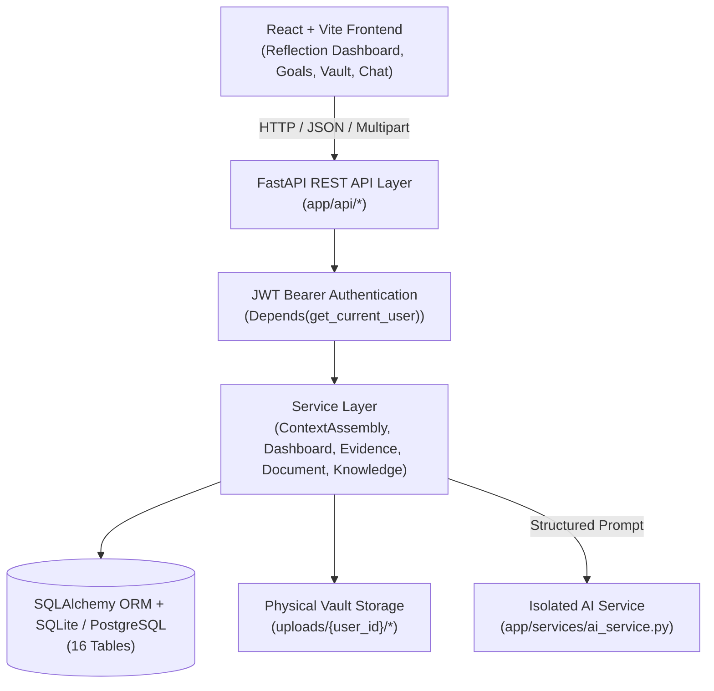

# MindVault — System Architecture

## 1. Overview

MindVault is an AI-powered persistent memory and personalized knowledge management system designed as a BCA Minor Project. Unlike standard chatbot wrappers that simply pass chat transcripts back to an LLM, MindVault maintains an evolving cognitive model of the user:
- **Evidence-Driven Knowledge Progression**: User knowledge level and confidence dynamically update through observable actions.
- **Relational Knowledge Graph**: Concepts, subjects, documents, and goals are mapped in a lightweight graph.
- **Strict Multi-Tenant Isolation**: Every database query, document chunk search, and upload directory is isolated by `user_id`.
- **Knowledge-Delta–Aware Context Assembly**: Synthesizes established concepts, knowledge gaps, learning style preferences, document chunks, and memory facts into a structured prompt.
- **Reflective Dashboard**: Analyzes behavioral shifts (14-day focus shift, rising concepts, stagnant topics, and goals needing attention) to mirror the user's cognitive state.

---

## 2. Core Architecture Layers

---

## 3. Database Schema (16 Relational Tables)

1. **`users`**: User identities with bcrypt-hashed passwords.
2. **`memories`**: Slot-scoped factual and preference statements with status lifecycles.
3. **`memory_history`**: Audit trail of every update/resolution to a memory.
4. **`memory_conflicts`**: Discrepancies between existing slot memories and incoming facts.
5. **`goals`**: High-level objectives with priority, status, and target dates.
6. **`tasks`**: Actionable milestones belonging to goals; completion emits evidence.
7. **`skills`**: Legacy skill entities maintained for backwards compatibility.
8. **`knowledge_concepts`**: Dynamic knowledge state (level 0–5, confidence 0–1, evidence counts).
9. **`knowledge_state_snapshots`**: Periodic progression snapshots for historical velocity.
10. **`learning_preferences`**: Inferred or stated user learning styles (e.g. `prefers_concrete_examples`).
11. **`evidence`**: Immutable append-only log of raw learning and activity events.
12. **`subjects`**: Connective domain entities bridging documents, concepts, and goals.
13. **`documents`**: Metadata for uploaded reference notes (PDF, DOCX, TXT).
14. **`document_chunks`**: 500-word sliding window excerpts with 50-word overlap for term-frequency retrieval.
15. **`knowledge_nodes`**: Graph vertices (CONCEPT, DOCUMENT, SUBJECT, GOAL, SKILL).
16. **`knowledge_relationships`**: Directed edges linking graph nodes with relationship types.

---

## 4. Context Assembly Pipeline (Virtual Brain)

When a user asks a question to the `/assistant/ask` endpoint:
1. **Concept Extraction & Knowledge Delta**: Required domain concepts are identified. The system queries the user's `KnowledgeConcept` table. Concepts with high confidence are marked as **Established**; low confidence or missing concepts are marked as **Gaps**.
2. **Learning Style Injection**: The user's active `LearningPreference` records with confidence $\ge 0.5$ are retrieved and injected to guide tone and style.
3. **Document Grounding**: User-owned `DocumentChunk` records are searched using term-frequency scoring to retrieve relevant vault excerpts.
4. **Memory Injection**: Active `Memory` facts are retrieved based on keyword relevance and slot keys.
5. **Prompt Assembly**: Instructions are partitioned:
   - Instruct the LLM *not* to explain established concepts.
   - Instruct the LLM to focus explanations on knowledge gaps.
   - Ground assertions using the retrieved vault chunks and memories.
6. **LLM Execution**: Handled through `ai_service.generate_response`. If `OPENAI_API_KEY` is absent, an explicit `AIProviderNotConfiguredError` is returned instead of fabricated content.

---

## 5. Security & Isolation Model

- **Authentication**: Stateless HMAC-SHA256 JWT tokens with configured expiration.
- **Tenant Scoping**: All database queries filter strictly by `user_id == current_user.id`.
- **Foreign Reference Validation**: Nodes in the knowledge graph validate ownership of underlying `ref_id` entities (`CONCEPT`, `DOCUMENT`, `SUBJECT`).
- **Filesystem Isolation**: Document uploads are stored in user-scoped directories (`backend/uploads/{user_id}/`), preventing cross-tenant file access or directory traversal.
- **Automated Verification**: Dedicated multi-user isolation suite (`test_user_isolation.py`) ensures complete isolation across all 9 core domains.
